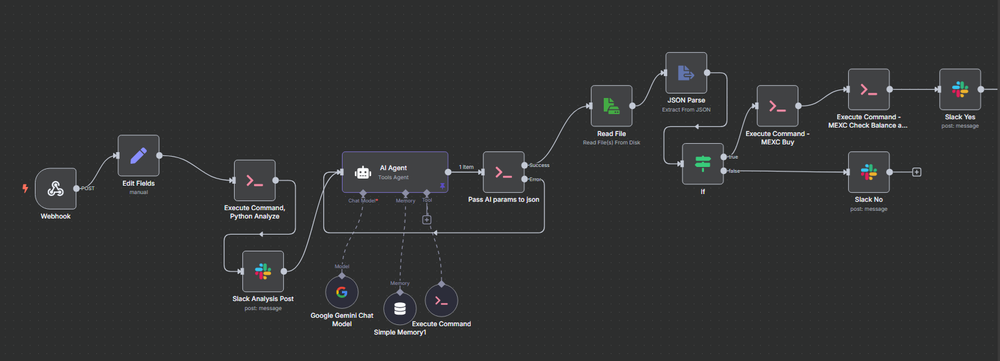

# AI Trading Agent with n8n

This project demonstrates how to create an AI agent workflow using n8n that can analyze historical price action, and make decision whether to trade your favorite instrument based on the analysis. If the agent decides that it's a good time to buy, it will automatically execute the trades based on the parameters that it sets in the same n8n workflow.

For this demonstration, I used `gemini-2.0-flash` from Gemini, since the API key was still free to use when I tested it the last time. I have a private repository where I swap the model from `gemini-2.0-flash` to my own finetuned model. Feel free to use the workflow and swap the model to your own preferred (or finetuned) model. You should also change the prompts for the AI to follow. 

The workflow itself is located in [n8n/ai_agent_n8n_workflow.json](n8n/ai_agent_n8n_workflow.json). You can import it to your n8n instance and start using it. It should look like the below image:

This demonstration basically extracts stock market historical data from AlphaVantage (https://www.alphavantage.co/) and store it in Supabase database. The AI agent will then analyze your preferred stock historical data in Slack (using slash command) and decide whether it's a good time to buy Bitcoin or not based on the analysis. If the AI agent decides to buy, it will open a buy position on MEXC in the pair of WBTC/USDT. The agent will also set the Take Profit and Stop Loss parameters based on the analysis, and will automatically try to market sell the open position (of the same WBTC/USDT) when the price reaches the Take Profit or Stop Loss levels.

Now you are probably wondering, why do I use stock market analysis to predict Bitcoin price? It's because Bitcoin often follows the stock market trend, especially tech stocks. Not only that, since this is a demonstration, I want to use freely-available API to fetch historical data, and AlphaVantage provides really good historical daily data for free that you can store (also for free) in Supabase. 

You can, of course, swap the data sources from AlphaVantage to, let's say, more relevant data (such as Bitcoin historical data) from other sources, you only need to change the extract script [vantage_extract.py](vantage_extract.py). They are typically not free though, and when they are, they are fairly limited.

As for the trading platform, you can swap MEXC to your preferred trading platform, such as with Binance or other platforms that you prefer. Change them in [mexc_buy.py](mexc_buy.py) and [mexc_check_balance_and_sell.py](mexc_check_balance_and_sell.py). As of now, the second script is basically monitoring the open position and will try to market sell it when the price reaches the Take Profit or Stop Loss levels. Different trading platforms may provide more convenient way to put TP and SL levels directly, even in spot market.

In order to start the n8n workflow, you need to have a connected Slack application, and use the slash command `/analyze` to trigger the workflow. If you need a free request URL in the slash commands, you can use ngrok (https://ngrok.com/) to expose your local n8n instance to the internet.

**Note**: This repository is not intended to be used for real trading, especially if you don't have your own customized data and model. Using generic LLM like `gemini-2.0-flash` is not recommended for real trading, since its observational capabilities are extremely basic, and will often make super random recommendations.

I will update the README.md file with more details on how everything works.